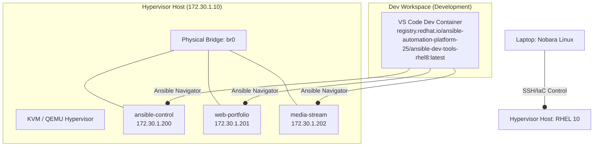

# Enterprise Hybird IaC Homelab: RHEL 10, KVM, Terraform & Ansible

An enterprise-grade, multi-tier virtualization homelab simulating a modern private cloud deployment. This project demonstrates Infrastructure as Code (IaC) provisioning and configuration management on a bare-metal Red Hat Enterprise Linux (RHEL) 10 hypervisor.

---

## 1. Project Purpose & Engineering Goals

In modern enterprise IT, infrastructure is no longer managed manually. The shift toward Cloud Native and DevSecOps models requires systems engineers to manage physical and virtual environments dynamically, safely, and repeatably.

The primary object of this project is to build a fully automated private cloud environment from a bare-metal baseline, demonstrating:
*   **Declarative Infrastructure:** Deploying virutal machines in a reproducible state using Terraform.
*   **Immutable Configuration:** Utilizing containerized Ansible Execution Environments to push OS settings, security updates, and packages.
*   **DevSecOps Best Practice:** Protecting system secrets (licenses, access credentials) using advanced AES-256 encryption.
*   **System Architecture Design:** Bridging physical and virtual network interfaces to allow guests to act as first-class citizens on the LAN.

---

## 2. Infrastructure Architecture

This lab runs on a dedicated physical **BOSGAME P3 Lite Mini PC** acting as out bare-metal hypervisor, controlled remotely from a development laptop.

---

## 3. Project Documentation

To make this project easily readable, the documentation has been divided into detailed technical chapters. Click any link below to dive into specific design decisions and troubleshooting logs:

[Hypervisor Setup](docs/01_hypervisor_setup.md)

[Terraform Provisioning](docs/02_terraform_provisioning.md)

[Ansible Automation](docs/03_ansible_automation.md)

[Music Streaming Service](docs/04_music_streaming_service.md)

[Homelab Portal Website](docs/05_homelab_portal_website.md)

[Centralized Identity Management](docs/06_centralized_identity_management.md)

[Private Git Server and GitOps Automation](docs/07_private_git_server_and_gitops.md)

[Monitoring and Observation Panel](docs/08_monitoring_and_observability.md)

// Include links and their pages