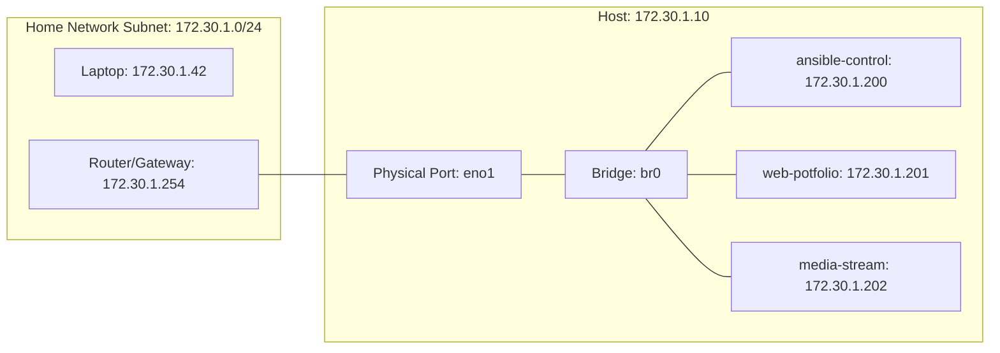

# Bare-Metal Hypervisor & Bridge Networking

[← Back to Main README](../README.md)

This section covers the host-level decisions, manual storage partitioning, and system-level networking involved in setting up my physical BOSGAME P3 Lite mini PC as a KVM hypervisor.

---

## 1. Operating System Selection: Minimal vs GUI

When setting up a RHEL 10 KVM host, the installer offers choices like "Server with GUI" or "Minimal Server."

### The Decision: Minimal Server (Headless)

I selected **Minimal Server**. In an enterprise environment, hypervisors are strictly headless to optimize resource efficiency and maximize security:

*   **Resource Conservation:** Running a GUI (like GNOME or KDE) consumes between 1GB and 2GB of host RAM. In a 32GB RAM mini PC, this is memory that is better spent running guest VMs.
*   **Security Hardening:** A headless system reduces the package footprint, lowering the number of running services and libraries that could contain vulnerabilities.
*   **Management Model:** The host is managed remotely using standard tools: **SSH** for terminal operations and the **RHEL Cockpit Web Console** (port 9090) for graphical network and storage administration.
 
---

## 2. Storage Partitioning: Logical Volume Manager (LVM)

By default, the RHEL installer allocates a small portion of the disk to the root ( / ) directory and the majority of the disk to the /home partition.

### The Challenge:

Virtual machine image files (.qcow2) are stored in /var/lib/libvirt/images/ by default, which resides on the root ( / ) parition. If I accepted the default parition layout, the root partition would fill up after creating just one or two virtual machines, even if there were hundreds of gigabytes free in /home.

### The Solution

Using the manual LVM paritioning screen in the RHEL installer:

1. I deleted the /home logical volume entirely.
2. I reallocated all the freed-up space directly to the root ( / ) logical volume.
3. This left the system with a tiny 1.3MiB of unallocated space, ensuring that almost the entire 1TB SSD is available to KVM for virtual machine storage.

---

## 3. Network Bridge (br0) Architecture

Virtual machines need to communicate with the network. KVM's default network uses Network Address Translation (NAT) via a virtual bridge interface named virbr0.

### NAT (Default) vs Physical Bridge (br0)

*   **NAT (Default):** The host hides the VMs behind its own IP address. The VMs can access the internet, but other computers on the LAN (like my laptop) cannot connect directly to the VMs.
*   **Physical Bridge (My Choice):** A network bridge acts like a virtual network switch. By creating the bridge interface br0 and enslaving the physical network card (eno1) to it, the VMs are connected directly to the physical home router. They obtain IP addresses in the same local subnet as the laptop, allowing bidirectional communication.

### Applying Network Settings Safely via RHEL Cockpit

Changing an active network inteface's settings over SSH is risky because restarting the connection can immediately lock you out of the server.

To mitigate this, I utilized the built-in **RHEL Cockpit Web Console:**

1. Cockpit provies a web-based GUI to create the bridge and bind the physical adapter (eno1) safely.
2. Cockpit includes a fail-safe rollback mechanism. When you apply network changes, Cockpit tests the connection. If the connection fails to restore within 10 seconds, it automatically rolls back the changes, preventing a permanent lock-out.