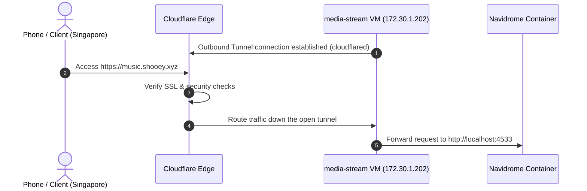

# Media Streaming Server with Rclone & Podman

[← Back to Main README](../README.md)

This section covers the deployment of Navidrome music server, mounting cloud storage via Rclone FUSE, container permission fixes, and secure WAN routing using Cloudflare Tunnels.

---

## 1. Storage Integration: Rclone Google Drive FUSE Mount

To host a massive music library without filling up the local mini PC SSD, I integrated Google Drive.

### The Challenge (Headless Authentication):

Rclone requires loggin in via a web browser (OAuth) to access Google Drive. Because media-stream VM is headless, I could not run a browser on it.

### The Solution:

1. I ran the configuration wizard (rclone config) locally on the laptop to perform the web browser OAuth handshake.
2. I copied the generated access token file (rclone.conf) into the Ansible workspace.
3. I worte an Ansible playbook to copy the token file to /root/.config/rclone/rclone.conf on the VM.
4. I configured a custom Systemd Service (rclone-mount.service) to run:

```bash
/usr/bin/rclone mount gdrive: /mnt/gdrive/Music --allow-other --vfs-cache-mode full
```

*   **--allow-other:** Permits the Podman container's non-root user to read the host mount.
*   **--vfs-cache-mode full:** Buffers files locally on the SSD. Instead of a 10-second internet lag every time a song changes, the player pre-buffers the next track in the background, providing gapless playback.

## 2. Container Configuration & Troubleshooting Log

### Issue #1: Navidrome Database Permissions Crash

*   **The Issue:** The Navidrome container crashed on boot with an error: `Error applying PRAGMA optimize: unable to open database file`.
*   **The Discovery:** The official Navidrome container runs as a secure non-root user with **UID 1000**. However, Ansible created the host directory /var/lib/navidrome as root:root. The container could not write its database files.
*   **The Resolution:** I modified the playbook to set the owner and group of /var/lib/navidrome to 1000:1000.

### Issue #2: SELinux Blocking Container Volume Mounts

*   **The Issue:** The container ran, but could not see the music files.
*   **The Discovery:** SELinux was blocking the container process from reading the host /mnt/gdrive and /var/lib/navidrome directories.
*   **The Resolution:** I appended the :z flag to the Podman volume mount (/mnt/gdrive/Music:/music:ro,z). This tells Podman to automatically apply the correct SELinux security context label to the directories.

## 3. GitHub Push Protection Block

When I attempted to push my new configuration to GitHub, the push was declined with a an error: `GH013 Repository rule violation: Push cannot contain secrets`.

### The Discovery:

I accidentally commited my plaintext rclone.conf token file in a previous local commit. GitHub's automated secret scanner detected the Google OAuth tokens and blocked the upload.

### The Resolution (Rewriting Local History):

To remove the secret from the Git history completely before pushing, I ran:

```bash
# Soft reset to undo the commit but keep the files
git reset --soft HEAD~1

# Tell git to stop tracking rclone.conf
git rm --cached ansible/rclone.conf

# Add ansible/rclone.conf to .gitignore
# Recommit the clean files and push successfully
git add .
git commit -m " Complete deploying Navidrome on media-stream server as  a service"
git push -u origin main
```

## 4. WAN Routing: Secure Access via Cloudlfare Tunnels

To allow remote streaming (e.g., from Singapore) without opening security holes in my home router, I deployed a Cloudflare Tunnel.



### Key Engineering Decisions:

1. **Zero Inbound Ports:** No port forwarding is configured on the home router. The VM opens an outbound-only connection (cloudflared), making the server completely invisible to public internet port scanners.
2. **Ansible Automation (deploy_tunnel.yml):** I wrote a playbook to install cloudflared via RPM and register the system service.
3. **Ansible Idempotency (creates):** Instead of using a separate stat check, I utilized the creates flag to ensure the registration command only runs if the service file doesn't exist:
```bash
- name: Install cloudflared systemd service
  ansible.builtin.command:
    cmd: "cloudflared service install {{ vault_cloudflare_token }}"
    creates: /etc/systemd/system/cloudflared.service
```
4. **Cloudflare Published Application Routing:** I configured Cloudflare to route the public subdomain music.shooey.xyz (HTTP) directoly to localhost:4533 via the tunnel.