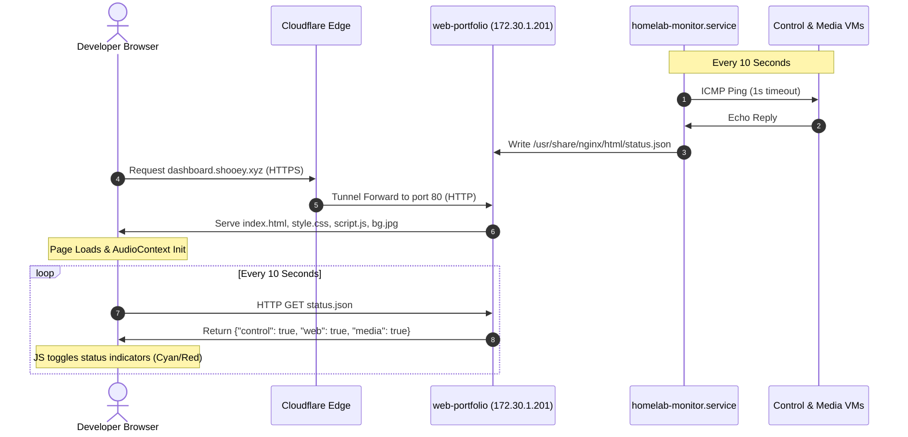

# Homelab Control Panel (Rapture Landing Page)

The Homelab Control Panel is a highly customized BioShock-themed webpage hosted on the web-portfolio VM (172.30.1.201) and served publicly via Cloudflare Tunnels. This page combined custom Art Deco auesthetics with dynamic backend systems monitoring and synthetic sound effects.

---

## 1. Architectural Overview & Data Flow

The portal acts as a central landing page for the homelab. It displays node metadata (IPs, roles) and integrates dynamic polling script that updates VM online/offline states.



---

## 2. Design System & Thematic Style

The styling is designed to mimic a run-down, water damaged post-civil-war terminal inside the underwater city of Rapture:

*   **Color Scheme:** Sourced from my Konsole colorscheme:
    *   *Base Background:* Deep forest-teal balck (rgb(14,24,23)).
    *   *Card Panels:* Frosted glass using rgba(11,20,19,0.92) with a heavy backdrop-filter: blur(24px).
    *   *Accents:* Bioluminescent cyan (rgb(51,224,208)) and oxidized Art Deco gold/brass (rgb(212,174,44)).
*   **Visual Enhancements:**
    *   *Double Frame:* A double-line gold outline border (outline: 6px double var(--rust-accent))
    *   *Vignette & Scanlines:* A dark viewport vignette shadow simulatoring deep-water claustrophobia, combined with horizontal CRT scanlihnes layerd behind the text cards to keep typography sharp.
    *   *Flickering Lights:* CSS @keyframes simulating power grid failures by randomly toggling oppacity on the header title and status indicators.
    *   *Slow Bubbles:* A fixed background layer animating glowing teal bubbles floating lazily upward.

---

## 3. Rapture Broadcast System

Instead of playing raw audio, the dashboard implements a vintage vacuum-tube AM radio weidget utiliizng the browser's Web Audio API:

1.  **CORS & file:// Bypassing:** To resolve browser security policies (which block Web Audio manipulation on external domains), a 6-song playlist of 1930s jazz tracks (Al Bowlly & Django Reinhardt) is downloaded locally and saved to website/audio/.
2.  **Bandpass Filter:** The audio stream is routed through a BiquadFilterNode before hitting the output destination:
    *   type = 'bandpass' (cuts deep bass and high treble).
    *   frequency.value = 1100 (centers the audio in the mid-range where vintage speakers peaked).
    *   Q.value = 1.8 (narrows the band, creating a tinny, lo-fi vacuum-tube effect).
3.  **Continuous Playlist Loop:** JavaScript tracks ended event handlers to aumatically load the next local track and update the "Now Playing" string.

---

## 4. Real-Time System Monitoring (Dynamic Pinging)

The status lights on the cards are backed by an automated server monitoring script:

1.  **Python Script (ping_status.py):** Deployed to /usr/share/nginx/html/, it loops through a dictionary of VM hosts and runs `ping -c 1 -W 1 <IP>`. It writes a dictionary of booleans directly to /usr/share/nginx/html/status.json.
2.  **Systemd Service (homelab-monitor.service):** Configured as a background daemon running an infinite loop with a 10-second sleep, starting automatically on boot:

```bash
[Unit]
Description=Homelab Nodes Status Monitor
After=network.target

[Service]
Type=simple
ExecStart=/bash -c "while true; do /usr/bin/python3 /usr/share/nginx/html/ping_status.py; sleep 10; done"
Restart=always

[Install]
WantedBy=multi-user.target
```

3.  **Frontend Poll:** The JavaScript fetches status.json asynchronously every 10 seconds and updates class names to .online (pulsing cyan) or .offline (pulsing red).

---

## 5. UI Micro-interactions & Sound Synthesis

The gaming-interface feel is completed with custom cursors and dynamic sound effects:

*   **Custom Cursors:** Base SVG custom cursors (gold pointers) and hover states (cyan pointers) are embedded directly inside style.css using Base64/SVG URIs, ensuring zero asset lag.
*   **Synthesized Switch Replay (Radio Switch):** When clicking hte radio ON/OFF switch, two oscillators (triangle and sawtooth waves) decay rapidly from high to low frequencies over 0.12 seconds, synthesiizng a heavy physical relay switch clack.
*   **Hover Tick (Card Enter):** Moving the mouse cursor into any card triggers a sine-wave oscillator decaying from 1400Hz to 400Hz in 0.03 seconds, creating a clean, mechanical UI selection click.

---

## 6. Infrastructure Deployment Automation

All Nginx, firewall, SELinux, and service setups are fully automated in the Ansible playbooks:

*   **deploy_website.yml:** Installs Nginx, opens ports via firewalld, and synchronizes files.
*   **deploy_monitor.yml:** Registers the background Python monitor and configures the systemd service, executing restorecon as an idempotent handler to fix SELinux labeling on /usr/share/nginx/html.