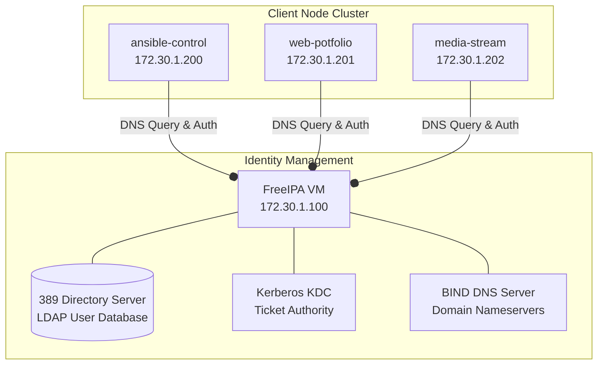

# Centralized Identity Management with FreeIPA

[← Back to Main README](../README.md)

This section details the deployment of a centralized identity, authentication, and DNS authority server using FreeIPA (LDAP, Kerberos, BIND, and PKI CA) on a dedicated VM, along with the automated enrollment of all existing system VMs as domain clients.

---

## 1. Architectural Overview & Domain Flow

FreeIPA acts as the central domain controller for the shooey.local network realm. It coordinates user accounts, SSH keys, host trust databases, and internal DNS resolution.

---

## 2. Infrastructure VM Provisioning (Terraform)

To avoid plugin crashes in the legacy dmacvicar/libvirt provider (which fails when attempting to import existing running domains containing NVRAM templates), the new VM was provisioned using the Clean Isolation Workaround:

1.  Existing running VMs were untracked from the Terraform state using `terraform state rm`.
2.  The terraform/main.tf configuration was modified to target only the new freeipa VM.
3.  The VM was successfully deployed with RHEL 9/10 base image, 4GB of RAM, and 2 vCPUs (necessary to support the LDAP cache and Java-based certificate system of FreeIPA).

---

## 3. Server Installation & Orchestration

The FreeIPA server was deployed using the deploy_ipa.yml playbook, resolving hte minimal RHEL python package dependencies:

*   **Host FQDN Alignment:** Set the hostname to ipa.shooey.local and appended it to /etc/hosts to satisfy the FreeIPA installer's DNS sanity checks.
*   **Dependency Order:** Installed packages (firewalld, python3-firewall, freeipa-server, and freeipa-server-dns) prior to running firewall tasks to provide the necessary Python API bindings.
*   **Unattended Setup:** Ran ipa-server-install with DNS setup, pointing to forwarders 1.1.1.1 and 8.8.8.8, and using encrypted directory/admin credentials loaded from vault.yml.

---

## 4. Dynamic Client DNS Redirection (configure_dns.yml)

To allow client VMs to locate the identity server, the DNS configurations on running nodes were updated to use 172.30.1.100 as their primary nameserver:

*   **NetworkManager Automation:** Used `nmcli con mod` to set the DNS for the cloud-init connection profile (cloud-init ens3) and triggered a connection reload (`nmcli con up`).
*   **Idempotency & Linting Enhancements:**
    *   *Trailing Newline Bug:* Wrapped the check condition in Jinja 2 | trim to remove hidden trailing newlines output by nmcli, preventing changes from executing repeatedly on every run.
    *   *Ansible-Lint Compliance:* Appended `changed_when: true` to the modification commands to satisfy the linter's no-changed-when rule.
    *   *Fault Tolerace:* Appended `failed_when: false` to the DNS verification task to prevent playbook execution failures when the ipv4.dns property is initially unset/empty.

---

# 5. Automated Client Enrollment (enroll_clients.yml)

Client nodes were joined to the directory realm using the enroll_clients.yml playbook:

*   **Package Deployment:** Installs freeipa-client packages.
*   **Host Enrollment:** Invokes `ipa-client-install --unattended` using secure credentials, binding the client UUIDs to the FreeIPA directory.
*   **Automatic Homedir Provisioning:** Passes the --mkhomedir flag to configure PAM (Pluggable Authentication Modules) to automatically create a local home directory (/home/username) on the VM the first time a centralized user logs in.