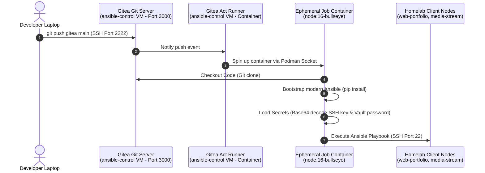

# Private Git Server and Gitops Automation (Gitea & Act Runner)

[Back to main README](../README.md)

This section details the deployment of a priavte, self-hosted Git server (Gitea) and an autopmated GitOps execution agent (Act Runner) inside rootless Podman containers on the ansible-control VM, creating a local CI/CD pipeline.

---

## 1. Architectural Overview & Workflow

The GitOps pipeline automates playbooks execution upon pushing code changes to Gitea. Gitea hosts the code, the Act Runner detects the push, spins up an ephemeral environment, downloads the playbooks, and runs them.

---

## 2. Server Deployment (deploy_gitea.yml)

Gitea was deployed as a container on ansible-control (172.30.1200):

*   **Database:** Configured to use a local SQLite database to keep the infrastructure lightweight and avoid separeate database containers.
*   **Port Mapping:** Exposed Gitea Web UI on port 3000 and mapped the container SSH srevice to host port 2222 to avoid port collisions with the VM's SSH service (port 22).
*   **Volume & SELinux:** Mounted /var/lib/gitea:/data:z using the :z flag to instruct Podman to automatically apply the correct SELinux lables for shared container storage.

---

## 3. Runner Configuration & Confinement Resolutions (deploy_runner.yml)

The Act Runner container interacts with the host's Podman engine to spin up build containers dynamically:

*   **Socket Mapping:** Mounted the host socket /run/podman/podman.sock into the container at /var/run/docker.sock to provide Docker API compatibility.
*   **SELinux Confinement Resolution:** Disallowed SELinux container labels specifically for runner using `security_opt: ["label=disable"]` and configured `user: "0", granting the runner process the security permissions needed to write to the host socket.
*   **Systemd Socket Lock Resolution:** Resolved a Systemd startup collision by deleting the stale socket file /run/podman/podman.sock on the host, preventing crashes caused by Systemd's inability to unlink sockets due to system policies.

---

## 4. GitOps Workflow Design (.gitea/workflows/deploy.yml)

The pipeline runs playbooks automatically on push:

*   **Dual Remotes:** Configured the local Git repository on the laptop with two taregts:
    *   origin: Public GitHub repository
    *   gitea: Private self-hosted Gitea repository
*   **Secure Secret Transmission:** Encrypted the SSH Private Key and Vault Decryption password as Gitea secrets. To bypass template engine whitespace stripping, the private key was encoded in Base64 and decoded inside the runner via `base64 -d`.
* **Python 3.12 Target Compatibility:** Bootstrapped the default node:16-bullseye runner container with python3-pip nad installed modern ansible via pip, replacing the outdated Debian system package Ansible and resolving Target VM connection crashes.