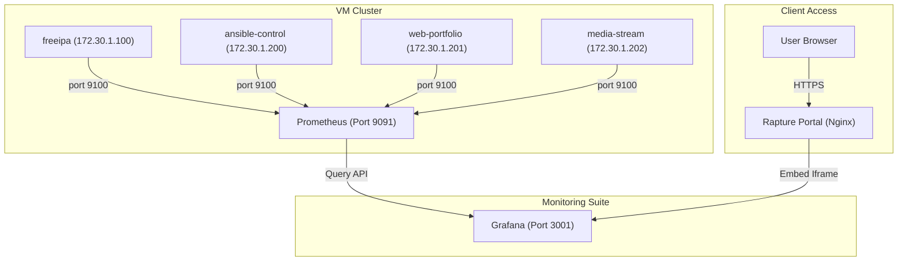

# Monitoring and Observability

[← Back to Main README](../README.md)

This section covers the deployment of a centralized monitoring and observability stack across the homelab cluster using Prometheus, Grafana, and Node Exporter, culminating in live-embedded metrics on the Rapture portal homepage.

---

## 1. System Architecture

The telemetry stack consists of three layers:

1.  **Metrics Collection (Node Exporter):** Runs as a host-networked Podman container on all four VMs, exposing raw OS metrics (CPU, RAM, disk, network) on port 9100.
2.  **Time-Series Database (Prometheus):** Runs on ansible-control (172.30.1.200:9091), scraping metrics from all node exporters every 15 seconds.
3.  **Data Visualization (Grafana):** Runs on ansible-control (172.30.1.200:3001), visualizing metrics from Prometheus.



## 2. Infrastructure Configuration

### Prometheus Configuration (ansible/prometheus.yml)

Defines the VM targets that Prometheus should scrape:

```yaml
global:
    scrape_interval: 15s
    evaluation_interval: 15s

scrape_configs:
    - job_name: 'homelab-nodes'
      static_configs:
        - targets:
            - '172.30.1.100:9100' # freeipa
            - '172.30.1.200:9100' # ansible-control
            - '172.30.1.201:9100' # web-portfolio
            - '172.30.1.202:9100' # media-stream
```

### Container Directory Permissions

For security, the database containers run as non-root users inside Podman. Host directories must be assigned to their respective container UIS:

*   **Prometheus (UID 65534 - nobody):** /var/lib/prometheus
*   **Grafana (UID 472 - grafana):** /var/lib/grafana

## 3. Web Dashboard Integration (Iframe Embedding)

To embed live charts on the public portal wihout requiring visitors to log in:

1. **Anonymous Access:** Enabled via the environment variables `GF_AUTH_ANONYMOUS_ENABLED=true` and `GF_AUTH_ANONYMOUS_ORG_ROLE=Viewer` in the Grafana container config.
2. **Frame Permissions:** Enabled via `GF_SECURITY_ALLOW_EMBEDDING=true` to prevent browser clickjacking blocks.
3. **Rolling Time-frames:** Appended `&from=now-5m&to=now` to the embed URLs to keep the charts scrolling in real-time.

```html
<iframe src="<Link>" class="telemetry-iframe" frameborder="0"></iframe>
```

## 4. Security & Remote Access

To protect the metrics panel while keeping them accessible:

1.  **Cloudflare Tunnel Routing:** The existing tunnel agent on media-stream is configured to route https://grafana.shooey.xyz to http://172.30.1.200:3001.
2.  **Zero Trust Access:** Protected using Cloudflare Access. Only authenticated emails receive the secure cookie required to load the Grafana subdomains, hiding internal metrics from the public.